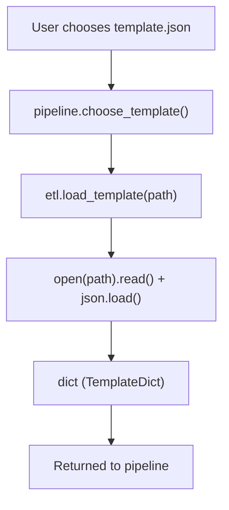
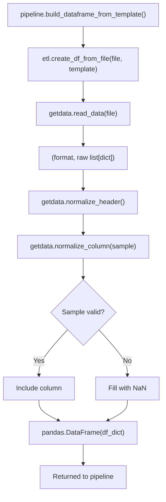
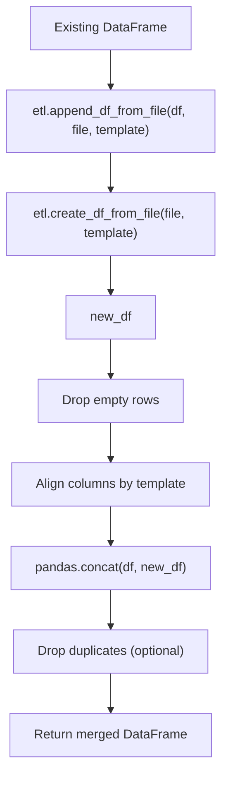
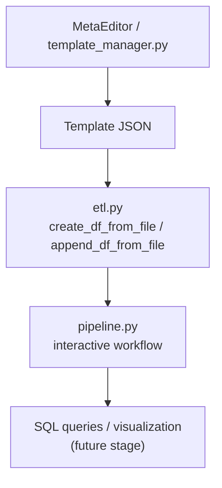

# Mini-project “databridge”

## Overview
**Databridge** is a learning/demo project showing the complete workflow:
raw data → ETL/ELT → SQL → visualization → business conclusions.

Main focus:
- Python (data handling, cleaning, ETL).
- SQL (aggregation, joins, window functions).
- Visualization for business analytics.
- Demonstration of development history and modular design.

## Project Goals
1. Demonstrate end-to-end data processing.
2. Practice Python + SQL integration.
3. Show reproducible workflow with modular architecture.
4. Document each stage for clarity and re-use.

## Data Sources (test)
- `sales.csv`: date, product, price, quantity.
- `customers.csv`: customer info, region, segment, age.
- `products.json`: categories, cost, discount.

**Reasons for cleaning/normalization:**
- Missing values.
- Different date formats.
- Duplicate records.
- Inconsistent categories.

## Workflow
1. **Raw sources** → cleaned with `MetaEditor` templates.
2. **ETL/ELT** → normalized DataFrames.
3. **SQL** → queries with aggregation and joins.
4. **Visualization** → charts (bar, line, pie).
5. **Business insights** → criteria and conclusions.

## Current Progress
- Modules implemented:
  - [`getdata.py`](./doc/getdata.md): read, detect format, normalize column/data.
  - [`template_manager.py`](./doc/template_manager.md): interactive template builder.
  - [`etl.py`](./doc/elt.md): helpers for DataFrame creation and merging.
  - [`devtools.py`](./doc/devtools.md): developer utilites for splitting source file, adding "noise", etc.
  - [`pipeline.py`](./doc/pipeline.md): interactive pipeline for building DataFrames from source files using templates.

- Development logs, detailed docs and examples → see [`doc/`](./doc/).

## Demonstration Criteria
- ETL/ELT from multiple sources.
- SQL queries with non-trivial aggregations.
- Charts for business analysis.
- Short report/log (what was cleaned, what conclusions drawn).

## Skills Demonstrated
- Python (pandas, numpy, matplotlib).
- SQL (JOIN, GROUP BY, window functions).
- Data preparation and normalization.
- Visualization and business requirement handling.
- ML critique (basic regression, error analysis).

## Repository Structure
```
Databridge/
├── Data                # sources, templates & results
│   ├── customers.csv
│   ├── products.json
│   ├── results
│   │   └── result_sales_meta.csv
│   ├── retail_sales_dataset.csv
│   ├── retail_store_sales.csv
│   ├── sales.csv
│   └── templates
│       └── sales_meta.json
├── README.md            # <- you are here
├── custom_types.py
├── devmenu.py
├── devtools.py
├── doc                  # detailed module documentation
│   ├── devtools.md
│   ├── etl.md
│   ├── getdata.md
│   ├── images
│   ├── pipeline.md
│   └── template_manager.md
├── etl.py
├── getdata.py
├── pipeline.py
└── template_manager.py

```

## Next Steps
1. Extend ETL/merging.
2. SQL queries + examples.
3. Visualization functions.
4. Documentation split into `doc/`.
5. Add optional tests.

---

## ETL Process Overview

The following diagrams describe the internal logic and data flow between modules in **Databridge**.

---

### 1️⃣ Template Loading (`load_template`)


#### Explanation:
The selected JSON template is loaded by etl.load_template() and parsed into a Python dictionary (TemplateDict) that defines which columns are saved, how they are named, and how they are normalized.

### 2️⃣ DataFrame Creation (create_df_from_file)

#### Explanation:
Each file is read and matched to template columns.
For every column defined in the template:

- The file headers are normalized.

- A short sample (≈10 rows) is passed to normalize_column() for validation.

- If normalization succeeds for at least one value, the column is included in the result DataFrame.

### 3️⃣ DataFrame Appending (append_df_from_file)

#### Explanation:
When several data sources are processed sequentially:

- Each is normalized via create_df_from_file().

- Columns are aligned according to the template.

- DataFrames are concatenated and optionally deduplicated.

### 4️⃣ High-Level Module Interaction

#### Explanation:
The complete process:

- MetaEditor defines a template.

- etl.py uses it to transform raw data into structured DataFrames.

- pipeline.py orchestrates the workflow (user interaction, file selection, saving).

- The resulting datasets are used for SQL analytics and visualization.

---
📖 **Detailed documentation:** see [`doc/`](./doc/)
