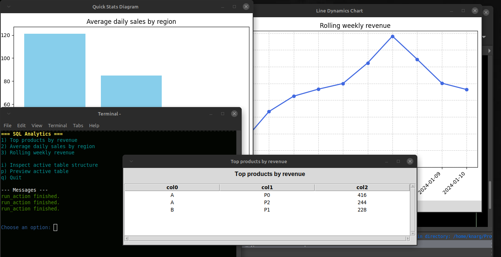
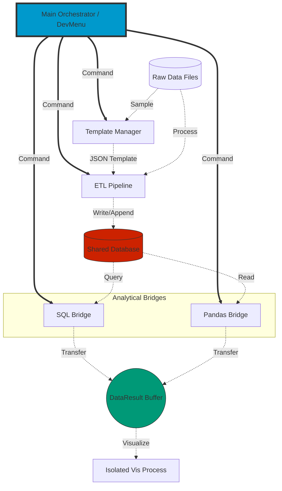

# DataBridge: Modular ETL & Analytical Platform

**Python Software Engineer | Node-based System Architecture | Concurrent Data Processing | Multiprocessing & IPC**

DataBridge is a high-performance, modular tool designed to bridge the gap between messy raw data and structured, visualizable insights. It demonstrates a complete, professional data-processing pipeline: **Raw Sources → Intelligent Normalization → ETL → SQLite Storage → Multi-engine Analytics → Isolated Visualization**.



## Typical Workflow: From Chaos to Insight

Imagine you have multiple CSV/Excel exports with inconsistent formatting. DataBridge solves this in three steps:

1. **Map It Once**: Create a **Reusable Metadata Blueprint** using the Template Manager. Define only the columns you need.
2. **Batch Process**: Apply that single template to one or dozens of files. The ETL engine extracts, cleans, and appends data to your SQL database automatically.
3. **Explore Instantly**: Run SQL or Pandas analytics. View high-level trends (AOV, Retention, Revenue) in interactive windows that run in **isolated processes**, keeping your UI responsive.

---

## Architectural Principles

The core of DataBridge is its **Hub & Spoke** architecture, ensuring maximum stability and maintainability.

### 1. True Modularity & Isolation
* **Zero Direct Interdependency**: Modules never exchange data directly. They interact solely with shared resources: the **Shared Database** and the **DataResult Transport Buffer**.
* **Vertical Command Flow**: A centralized Orchestrator issues commands via a unified `DevMenu` API. Horizontal or "bottom-up" requests are prohibited to prevent spaghetti-code and prohibited to ensure code maintainability.
* **Independent Execution**: Every major node (ETL, Template Manager, Analytics) can be run as a standalone `__main__` application for simplified debugging.

### 2. High-Performance Visualization (IPC)
To ensure a zero-lag user experience, the **Visualization Engine** runs in a completely separate OS process. This allows you to interact with complex Matplotlib charts while keeping the main terminal UI responsive.

### 3. Safety & Integrity
* **Strict Typing**: Built for **Python 3.9+** with comprehensive Type Hinting.
* **Guard Clauses**: Integrated checks for "empty results" or unsupported data types prevent system crashes, providing informative GUI alerts instead.

---

## System Overview (Mermaid)



## Module Map
Each module is an independent unit. For detailed logic, see the dedicated documentation in [`doc/`](./doc/):
- **Entry point:**
   - [`main.py`](doc/main.md)
- **ETL & Ingestion:**
   - [`getdata.py`](./doc/getdata.md): detect format, read raw files, normalize headers and column values.
   - [`template_manager.py`](./doc/template_manager.md): interactive metadata blueprint creation.
   - [`etl.py`](./doc/etl.md): core normalization and schema alignment logic.
   - [`devtools.py`](./doc/devtools.md): developer utilities for splitting files, adding noise, testing workflows.
- **Analytics & Bridge Layer:**
   - [`sqlbridge.py`](./doc/sql_layer.md) / [`sqlfuncs.py`](./doc/sql_layer.md): SQL-based analytical engine
   - [`pdbridge.py`](./doc/pdbridge.md) / [`pdfuncs.py`](./doc/pdfuncs.md): Pandas-based analytical engine.
- **System Core:**
   - [`pipeline.py`](./doc/pipeline.md): orchestrates the ETL-to-DB flow.
   - [`dbtools.py`](./doc/dbtools.md): database maintenance and health tools.
   - [`config.py`](./doc/config.md): centralized configuration module — manages paths, active table state, and common runtime settings.
- **Visualization Engine:**
   - [`vis/vis_core`](./doc/vis.md), [`vis.visfuncs`](./doc/vis.md): the project's graphical engine. Provides standardized entry points (`show_table`, `execute_in_process`) for displaying data. It manages the lifecycle of UI threads and independent OS processes, ensuring the main application remains responsive.


## Demonstration Criteria
- Consistent ETL process from multiple heterogeneous sources.
- SQL analytics (aggregations, grouping, joins).
- Pandas analytics (trends, grouping, retention metrics).
- Result files for further visualization (CSV).
- Clear documentation of each module and stage.


## Skills Demonstrated
- Python (pandas, sqlite3, pathlib)
- ETL design and template-driven normalization
- SQL (GROUP BY, window functions)
- Data cleaning and schema alignment
- Modular architecture and reproducible workflows

---

## Repository Structure
```
Databridge/
├── Data
│   ├── config.txt
│   ├── customers.csv
│   ├── customers_noisy.csv
│   ├── products.json
│   ├── results
│   │   ├── analytics
│   │   │   ├── Average Order Value (AOV).csv
               ...
│   │   │   └── Weekly sales trend.csv
│   │   ├── databases
│   │   │   └── bridge.db
│   │   ├── result_retail_sales_dataset_meta.csv
               ...
│   │   └── result_sales_meta.xlsx
│   ├── retail_sales_dataset.csv
│   ├── retail_store_sales.csv
│   ├── sales.csv
│   └── templates
│       ├── retail_sales_dataset_meta.json
│       └── sales_meta.json
├── README.md
├── README_old.md
├── __init__.py
├── config.py
├── custom_types.py
├── dbtools.py
├── devmenu.py
├── devtools.py
├── doc
│   ├── config.md
│   ├── dbtools.md
│   ├── devtools.md
│   ├── etl.md
│   ├── getdata.md
│   ├── images
│   │   └── bridge_overview.png
│   ├── main.md
│   ├── pdbridge.md
│   ├── pipeline.md
│   ├── sql_layer.md
│   ├── template_manager.md
│   └── vis.md
├── etl.py
├── getdata.py
├── main.py
├── pdbridge.py
├── pdfuncs.py
├── pipeline.py
├── shared_library.py
├── sqlbridge.py
├── sqlfuncs.py
├── template_manager.py
└── vis
    ├── __init__.py
    ├── vis_core.py
    └── visfuncs.py


```

## Tech Stack

   - Language: Python 3.9+

   - Data: Pandas, SQLAlchemy, SQLite/PostgreSQL

   - UI/Vis: Matplotlib, Tkinter (Isolated via Multiprocessing)

   - Design: Node-based Architecture with Custom IPC Transport
