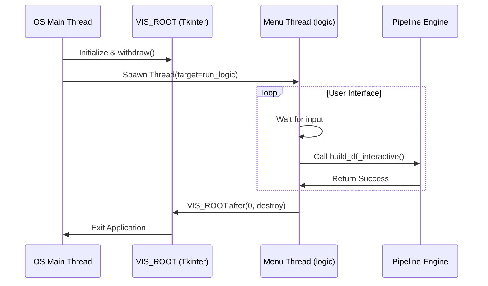

# Entry Point (`main.py`)

The `main.py` module is the **Central Command Hub** of the Databridge platform. It initializes the environment and provides the primary user interface.

## Responsibilities

### 1. Application Lifecycle Management
`main.py` is responsible for:
- Initializing the **Global Event Loop** (`VIS_ROOT`) in the main OS thread.
- Orchestrating the clean shutdown of all background threads and processes.

### 2. UI Orchestration
It uses `DevMenu` to provide a non-blocking terminal interface. While the menu runs in a dedicated background thread, the main thread remains open to handle GUI events from visualization windows.

### 3. Dependency Injection
It acts as a coordinator between various nodes:
- **ETL Node** (`pipeline.py`)
- **SQL Analytics** (`sqlbridge.py`)
- **Pandas Analytics** (`pdbridge.py`)
- **Maintenance** (`dbtools.py`)

## Standalone Execution Logic

```python
if __name__ == "__main__":
    # 1. Start UI MainLoop (Required for Tkinter)
    # 2. Spawn Menu Thread
    # 3. Handle graceful exit
```
### Technical Note: The "Main Loop" Anchor

A critical architectural feature of `main.py` is the management of the VIS_ROOT. To prevent "Main loop not in main thread" errors, `main.py` ensures that all graphical elements (Tables, Charts) share a single event loop anchored to the application's primary thread.

